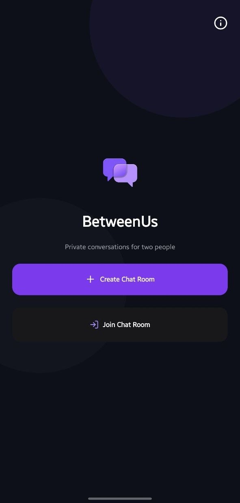
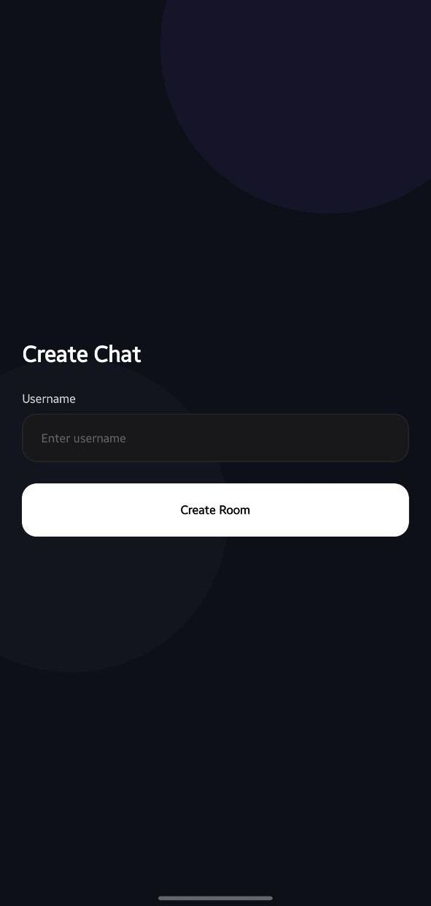
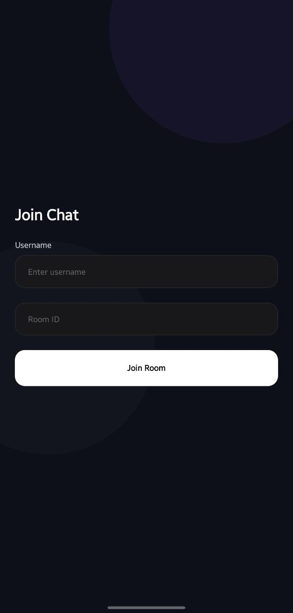
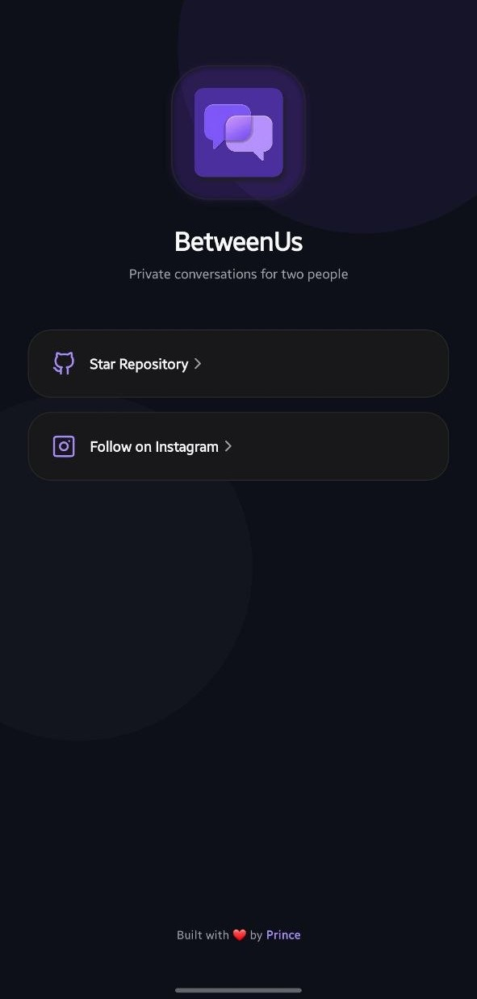

# BetweenUs 💬

A minimalist, real-time, private chat application designed for seamless conversations between exactly two people. Create a room, share it instantly, and start chatting — no accounts, no trackers, no unnecessary complexity.

## 📸 Previews

| **Home Screen** | **Create Screen** | **Join Screen** | **Info Screen** |
| :--------------: | :-------------: | :-------------: | :---------------: |
|  |  |  |  |

## 🎯 What is BetweenUs?

`BetweenUs` is a real-time private chat application focused on temporary conversations between exactly two users. Instead of forcing users to create accounts or maintain friend lists, the workflow is stripped down to the absolute essentials:

```markdown

┌─────────────┐     ┌────────────┐     ┌───────────┐     ┌────────────────────┐
│ Create Room │ ──> │ Share Room │ ──> │ Join Room │ ──> │ Start Conversation │
└─────────────┘     └────────────┘     └───────────┘     └────────────────────┘

```

### 🧠 Learning Objectives

This project was built from scratch to dive deep into:

* **Real-time Communication:** Mastering WebSocket lifecycles and event-driven data flow.
* **Socket Architecture:** Creating clean, decoupled backend architectures for rooms and states.
* **Mobile App Development:** Designing cross-platform native apps with deep-linking support.
* **State Management:** Handling transient application state and connection status smoothly.
* **Production Deployment Flow:** Structuring apps for scalable backend and frontend separation.

## ✨ Features

* ⚡ **Real-time Messaging:** Zero-latency messaging powered by WebSockets.
* 🔒 **Private 2-Person Rooms:** Strict enforcement of maximum 2 peers per room for complete privacy.
* 🔗 **Deep Linking Support:** Share room invites that instantly open or redirect to the app.
* ⌨️ **Typing Indicators:** Real-time visual feedback when the other user is typing.
* 🟢 **Online / Waiting States:** Immediate interface updates when a peer joins or disconnects.
* 🧹 **Automatic Room Cleanup:** Temporary room architecture that wipes data automatically when peers leave.
* 📋 **Quick Copy System:** One-click copying of Room IDs and Invite Links.
* 🌙 **Modern Dark UI:** Clean, distraction-free aesthetic built for modern mobile screens.

---

## 🛠️ Tech Stack

### Frontend

* **Framework:** React Native (Expo & Expo Router)
* **Language:** TypeScript
* **State Management:** Zustand
* **Styling:** NativeWind (Tailwind CSS for React Native)
* **Real-time Client:** Socket.IO Client

### Backend

* **Environment:** Node.js
* **Framework:** Express
* **Language:** TypeScript
* **Real-time Server:** Socket.IO

---

## 📂 Project Structure

```text
msg-project/
├── app/                  # Frontend Mobile Application (React Native)
│   ├── app/              # Expo Router File-based Navigation & Screens
│   ├── components/       # Reusable UI Elements (Buttons, Inputs, Chat Bubbles)
│   ├── services/         # Socket.io client setup and API connections
│   └── stores/           # Zustand State Management
│
└── server/               # Backend Server (Node.js)
    ├── rooms/            # Room state management and logic
    ├── socket/           # WebSocket event handlers and connection setups
    ├── users/            # Active user tracking logic
    └── utils/            # Helper functions and constants

```

## 🚀 Getting Started

### Prerequisites

* Node.js (v18 or higher recommended)
* npm or yarn
* Expo Go app on your physical device (or an Android/iOS emulator)

### 1. Backend Setup

1. Navigate to the server folder:

    ```bash
    cd server
    ```

2. Install dependencies:

    ```bash
    npm install
    ```

3. Start the development server:

    ```bash
    npm run dev
    ```

### 2. Frontend Setup

1. Navigate to the app folder:

    ```bash
    cd ../app
    ```

2. Install dependencies:

    ```bash
    npm install
    ```

3. Start the Expo development server:

    ```bash
    npm start
    ```

4. Scan the QR code with your Expo Go app to launch the app!

---

## 📖 Lessons Learned

Building `BetweenUs` provided valuable hands-on experience with:

* **Socket Lifecycles:** Managing connection drops, unexpected client disconnections, and automatic cleanups without memory leaks.
* **Mobile State Management:** Syncing local UI states instantly with asynchronous event updates from the backend using Zustand.
* **Decoupled Architecture:** Separating business logic, socket event layers, and data stores cleanly on both the frontend and backend.

---

## 🔮 Future Improvements

* [ ] **Push Notifications:** Alert users when a chat room invite is accepted.
* [ ] **Background Notifications:** Keep connection statuses responsive when the app is minimized.
* [ ] **Persistent Messages:** Optional end-to-end encrypted (E2EE) database persistence for active sessions.
* [ ] **Media Sharing:** Support for sending real-time pictures and voice notes.
* [ ] **Read Receipts:** Visual indicators showing when a message has been read.

---

```
👤 Author

Built with ❤️ by **Prince**

If you found this project interesting or useful, please give it a ⭐ **Star** on GitHub!
```
